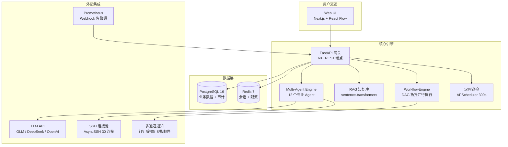

# ITOps Platform — AI 驱动的智能运维自动化平台

<p align="center">
  <strong>🚀 在线演示：<a href="http://8.137.178.63">http://8.137.178.63</a></strong>
  &nbsp;|&nbsp;
  <strong>📖 <a href="#快速开始">快速开始</a></strong>
  &nbsp;|&nbsp;
  <strong>🐳 <a href="#docker-compose-一键部署">Docker 部署</a></strong>
  &nbsp;|&nbsp;
  <strong>☸️ <a href="#kubernetes-部署">K8s 部署</a></strong>
</p>

<p align="center">
  
  
  
  
  
  
</p>

---

## 📖 项目简介

ITOps Platform 是一个 **AI 驱动的智能运维自动化平台**，将"告警触发 → 故障诊断 → 命令生成 → 安全拦截 → SSH 执行 → 结果验证 → 多通道通知"全流程自动化。

传统运维中，Prometheus 告警触发后需要人工 SSH 逐台排查、靠个人经验修复、手动记录处理结果。ITOps 通过 **12 个专业 AI Agent + RAG 语义检索知识库 + 可视化工作流引擎**，将 MTTR（平均修复时间）从 **30 分钟降低到 3 分钟**。



---

## 🎯 解决的核心问题

| 痛点 | 传统方式 | ITOps 方案 |
|------|---------|-----------|
| **告警响应慢** | 人工 SSH 逐台排查，MTTR ~30 分钟 | AI 自动诊断+修复，MTTR ~3 分钟 |
| **知识碎片化** | 运维经验分散在个人脑中，无法复用 | RAG 语义检索知识库，AI 基于真实经验回答 |
| **操作风险高** | 手动执行命令，无审计追溯 | 13 条危险命令黑名单 + 完整审计日志 |
| **重复劳动** | 80% 告警是固定套路，每次都手动处理 | 工作流引擎编排，自动执行 |
| **通知单一** | 仅邮件告警，容易遗漏 | 5 通道通知（钉钉/企微/飞书/邮件/Webhook） |

---

## ✨ 核心功能

### 🤖 12 个专业 AI Agent

| Agent | 功能 | SSH | LLM |
|-------|------|:---:|:---:|
| `monitor` | CPU / 内存 / 磁盘 / 负载 / 进程 / 连接数采集 | ✅ | 可选 |
| `diagnostic` | 根因分析，生成假设+证据链 | ✅ | ✅ |
| `remediation` | 预检 → 修复 → 验证三步安全修复 | ✅ | ✅ |
| `alert_analyzer` | 告警严重程度评估（P0-P4） | ❌ | ✅ |
| `log_analyzer` | journalctl / dmesg 日志取证与异常识别 | ✅ | ✅ |
| `change_executor` | 变更计划 + 回滚方案生成 | 可选 | ✅ |
| `doc_generator` | Markdown 巡检报告生成 | 可选 | ✅ |
| `compliance_checker` | 8 项安全合规检查评分 | ✅ | ✅ |
| `shell_command` | 直接执行 Shell，**不依赖 LLM** | ✅ | ❌ |
| `health_check` | HTTP GET 检查服务健康状态 | ❌ | ❌ |
| `webhook` | POST 上游结果到 Webhook URL | ❌ | ❌ |
| `generic` | 通用运维助手，意图识别自动路由 | ❌ | ✅ |

### 🔧 AI 自动修复管道

```
Prometheus Webhook → 告警入库(去重) → RAG 知识检索 → LLM 生成命令
    → 13项安全检查 → SSH 连接池执行 → LLM 分析结果 → 更新告警状态 → 多通道通知
```

**三层安全防护：**
1. **Prompt 层** — Agent system prompt 禁止 `kill -9`、`rm -rf`、`reboot` 等危险操作
2. **正则拦截层** — 13 条规则匹配 `dd if=`、`mkfs`、fork 炸弹、`chmod 777 /`、`curl|sh` 等
3. **审计层** — 所有修复操作记录完整审计日志（命令、输出、退出码、耗时）

### 📚 RAG 知识库 (Institutional Memory Kernel)

- **模型**：`sentence-transformers/all-MiniLM-L6-v2`（80MB，CPU 友好，免费）
- **原理**：知识库条目 → 384 维向量 → 余弦相似度检索 → Top-K 片段拼入 LLM Prompt
- **容错**：模型加载失败自动降级为空上下文，不阻塞 AI 管道（fail-open）

### 🕐 定时巡检 + 日志事件检测

- **300 秒/次**定时巡检所有启用的服务器
- **指标超阈值自动告警**：CPU / 内存 / 磁盘，超过 120% 阈值自动升级为 `critical`
- **8 类日志异常自动识别**：OOM Killer、段错误(Segfault)、Hung Task、磁盘 I/O 错误、网络 SYN Flood、Kernel Panic、硬件错误(MCE)、文件系统错误

### 🔗 可视化工作流引擎 (Low-Code Automation Studio)

- **React Flow 拖放编辑器**：12 个 Agent 节点从面板拖入画布，连线构建 DAG
- **4 个预设模板**：服务健康监控 / 磁盘巡检告警 / 日志错误扫描 / 服务器全量巡检
- **DAG 并行执行**：拓扑排序 → BFS 分层 → 同层 `asyncio.gather` 并发
- **条件分支**：支持 `contains:` / `not_contains:` 表达式控制执行路径
- **超时+重试**：每个节点独立配置超时和最大重试次数

### 📢 多通道告警通知

| 通道 | 特性 |
|------|------|
| 钉钉 | HMAC-SHA256 签名，Markdown 消息 |
| 企业微信 | Markdown 消息 |
| 飞书 | 交互式卡片 + 签名 |
| 邮件 | SMTP / TLS |
| 通用 Webhook | JSON POST |

### 📊 可观测性

- **Prometheus `/metrics`**：HTTP 请求计数/延迟/并发数、LLM 调用量/延迟/Token 消耗、数据库连接数、活跃告警数
- **结构化日志**：JSON 格式 + `request_id` 全链路追踪
- **审计日志**：所有服务器操作自动记录用户名、操作类型、IP、时间

---

## 🏗️ 技术栈

| 层级 | 技术 | 说明 |
|------|------|------|
| **后端框架** | FastAPI + Pydantic v2 | 原生异步 (asyncio)、自动 OpenAPI 文档、依赖注入 |
| **ORM** | SQLAlchemy 2.0 (async) | 异步查询、连接池管理、`select()` 新 API |
| **前端框架** | Next.js 16 + React 19 | App Router、SSR、API Rewrites |
| **前端样式** | Tailwind CSS 4 | 暗色主题、响应式布局 |
| **工作流 UI** | @xyflow/react (React Flow) | 拖放节点编辑器、自定义 Agent 节点 |
| **数据库** | PostgreSQL 16（生产）/ SQLite（开发） | UUID 主键、14 张表完整审计 |
| **缓存** | Redis 7 | 会话管理、固定窗口限流、缓存 |
| **SSH** | AsyncSSH | 原生异步、连接池（最大 30 连接、LRU 驱逐） |
| **LLM** | GLM-4 / DeepSeek / OpenAI | 策略模式、按用户 Key 隔离计费 |
| **向量模型** | all-MiniLM-L6-v2 | 384 维向量、CPU 推理、80MB |
| **任务调度** | APScheduler | AsyncIOScheduler、嵌入进程 |
| **容器化** | Docker 多阶段构建 | Builder + Runtime 分离 |
| **编排** | Docker Compose / Kubernetes + Helm | 一键部署 + 三级健康探针 |
| **CI/CD** | GitHub Actions | lint → test → build → 推送阿里云 ACR |
| **反向代理** | Nginx | API 代理、缓冲关闭、300s 超时 |
| **监控** | Prometheus | 10 个业务指标 + HTTP 指标 |

---

## 🚀 快速开始

### 环境要求

- **Docker** & **Docker Compose** v2+
- 或者：Python 3.11+ / Node.js 20+ / PostgreSQL 16+ / Redis 7+

### Docker Compose 一键部署

```bash
# 1. 克隆仓库
git clone https://github.com/okudhdheheuus/Python_AIops.git
cd Python_AIops

# 2. （可选）配置 LLM API Key — 不配置也能启动，AI 功能需要 Key
# 编辑 docker-compose.yml，填写 GLM_API_KEY
# 免费申请：https://open.bigmodel.cn/ → 注册 → API Keys → 创建

# 3. 启动全部服务（PostgreSQL + Redis + Backend + Frontend）
docker compose up -d

# 4. 查看日志确认启动成功
docker compose logs -f backend
```

启动后访问：

| 服务 | 地址 | 说明 |
|------|------|------|
| **前端界面** | http://localhost:3000 | 注册账号后登录 |
| **后端 API** | http://localhost:8000 | REST API |
| **Swagger 文档** | http://localhost:8000/docs | 60+ 端点在线测试 |
| **Prometheus 指标** | http://localhost:8000/metrics | 监控数据 |
| **健康检查** | http://localhost:8000/health/live | 存活探针 |

### 本地开发

**后端：**

```bash
cd backend
python -m venv .venv
source .venv/bin/activate   # Windows: .venv\Scripts\activate
pip install -r requirements.txt
cp .env.example .env         # 编辑配置（数据库地址、API Key 等）
uvicorn backend.main:app --reload --port 8000
```

**前端：**

```bash
cd frontend-next
npm install
npm run dev                  # 访问 http://localhost:3000
```

---

## ⚙️ 配置说明

### 环境变量

主要配置项（通过 `.env` 文件或 Docker 环境变量设置）：

| 变量 | 说明 | 默认值 |
|------|------|--------|
| `SECRET_KEY` | JWT 签名密钥，**生产环境务必修改** | — |
| `DATABASE_URL` | 数据库连接串 | `sqlite+aiosqlite:///./data/itops.db` |
| `REDIS_HOST` | Redis 地址 | `localhost` |
| `REDIS_PORT` | Redis 端口 | `6379` |
| `GLM_API_KEY` | 智谱 GLM API Key（免费模型推荐） | — |
| `DEEPSEEK_API_KEY` | DeepSeek API Key | — |
| `OPENAI_API_KEY` | OpenAI API Key | — |
| `OPENAI_API_BASE` | OpenAI 兼容 API 地址 | `https://api.openai.com/v1` |
| `CORS_ORIGINS` | 允许的跨域来源 | `http://localhost:3000` |
| `HF_ENDPOINT` | HuggingFace 镜像（国内部署用） | `https://hf-mirror.com` |
| `LOG_LEVEL` | 日志级别 | `INFO` |

### 免费 LLM API Key 获取

平台默认使用 **GLM-4-Flash**（智谱 AI 免费模型）：

1. 访问 [智谱 AI 开放平台](https://open.bigmodel.cn/)
2. 注册账号 → 控制台 → API Keys → 创建 API Key
3. 将 Key 填入环境变量 `GLM_API_KEY`
4. 登录平台后，在「设置 → LLM API 配置」页面填入 Key 即可

---

## 📡 API 概览

| 路由前缀 | 说明 |
|----------|------|
| `/api/auth` | 用户注册、登录、Token 刷新 |
| `/api/servers` | 服务器 CRUD、SSH 连接测试 |
| `/api/workflows` | 工作流模板 CRUD、执行、历史查询 |
| `/api/alerts` | Prometheus Webhook 接收、告警列表、统计、静默规则 |
| `/api/alerts/{id}/remediate` | 手动触发 AI 修复 |
| `/api/patrol` | 定时巡检记录查询 |
| `/api/chat` | AI 对话（SSE 流式 + RAG 上下文） |
| `/api/knowledge` | 知识库 CRUD、语义检索、预设数据导入 |
| `/api/notifications` | 通知渠道配置（钉钉/企微/飞书/邮件/Webhook） |
| `/api/user/llm-config` | 用户 LLM API Key 配置 |
| `/api/user/agent-config` | 用户 Agent 偏好设置 |
| `/api/dashboard` | 仪表盘统计数据 |
| `/api/audit` | 操作审计日志查询 |
| `/health/live` | Kubernetes Liveness Probe |
| `/health/ready` | Kubernetes Readiness Probe |
| `/health/startup` | Kubernetes Startup Probe |
| `/metrics` | Prometheus 指标端点 |

完整 API 文档启动后访问：**http://localhost:8000/docs**

---

## 📁 项目结构

```
Python_AIops/
├── backend/                       # FastAPI 后端
│   ├── api/                       # 路由模块
│   │   ├── auth.py                #   认证（登录/注册/Token）
│   │   ├── servers.py             #   服务器管理
│   │   ├── alerts.py              #   告警接收 + 静默 + 修复
│   │   ├── workflows.py           #   工作流 CRUD + 执行
│   │   ├── chat.py                #   AI 对话（SSE 流式）
│   │   ├── knowledge.py           #   知识库 CRUD + 语义检索
│   │   ├── notifications.py       #   通知渠道管理
│   │   ├── patrol.py              #   巡检记录查询
│   │   ├── dashboard.py           #   仪表盘统计
│   │   ├── audit.py               #   审计日志
│   │   └── user_config.py         #   用户 LLM / Agent 配置
│   ├── core/                      # 中间件 & 基础设施
│   │   ├── middleware.py          #   RequestID / RateLimit / Prometheus
│   │   ├── logging_config.py      #   JSON 结构化日志
│   │   ├── redis.py               #   Redis 客户端
│   │   └── rate_limit.py          #   固定窗口限流
│   ├── services/                  # 业务逻辑层
│   │   ├── agent_executor.py      #   12 个 Agent 执行器（核心）
│   │   ├── workflow_engine.py     #   DAG 拓扑排序 + 并行执行引擎
│   │   ├── knowledge_service.py   #   RAG 语义检索（sentence-transformers）
│   │   ├── llm_service.py         #   LLM 调用封装
│   │   ├── notification_service.py#   多通道通知服务
│   │   ├── ssh_pool.py            #   SSH 连接池（AsyncSSH）
│   │   └── llm/                   #   LLM Provider 策略模式
│   │       ├── base.py            #     BaseLLMProvider 抽象基类
│   │       ├── openai_provider.py #     OpenAI 兼容 Provider
│   │       ├── deepseek_provider.py#    DeepSeek Provider
│   │       ├── glm_provider.py    #     GLM Provider
│   │       └── factory.py         #     Provider 工厂
│   ├── utils/                     # 工具函数
│   │   └── security.py            #   JWT + bcrypt + RBAC
│   ├── models.py                  # SQLAlchemy 14 张表模型
│   ├── schemas.py                 # Pydantic v2 校验模型
│   ├── config.py                  # BaseSettings 配置管理
│   ├── database.py                # async_sessionmaker + 自动建表
│   ├── main.py                    # FastAPI 入口 (lifespan)
│   └── requirements.txt           # Python 依赖
├── frontend-next/                 # Next.js 16 前端
│   └── src/
│       ├── app/                   # App Router 页面
│       │   ├── layout.tsx         #   根布局（暗色主题）
│       │   ├── page.tsx           #   仪表盘首页
│       │   ├── login/page.tsx     #   登录页
│       │   ├── settings/page.tsx  #   LLM / Agent 配置页
│       │   ├── alerts/page.tsx    #   告警中心
│       │   ├── servers/page.tsx   #   服务器管理
│       │   ├── workflows/page.tsx #   工作流列表
│       │   ├── patrol/page.tsx    #   巡检记录
│       │   ├── knowledge/page.tsx #   知识库管理
│       │   ├── notifications/page.tsx  # 通知渠道
│       │   └── chat/page.tsx      #   AI 对话
│       ├── components/            # React 组件
│       │   ├── WorkflowEditor.tsx #   工作流编辑器（核心）
│       │   ├── AgentNode.tsx      #   自定义 Agent 节点卡片
│       │   ├── AgentPalette.tsx   #   节点拖放面板
│       │   ├── ConfigPanel.tsx    #   节点配置面板
│       │   └── Sidebar.tsx        #   侧边导航栏
│       └── lib/                   # 工具库
│           ├── agentTypes.ts      #   Agent 类型定义
│           ├── workflowTemplates.ts # 工作流预设模板
│           ├── auth.ts            #   认证上下文 + authFetch
│           └── api.ts             #   API 调用封装
├── nginx/                         # Nginx 反向代理配置
├── k8s/                           # Kubernetes 部署清单
│   ├── namespace.yaml
│   ├── configmap.yaml
│   ├── secret.yaml
│   ├── postgres-deployment.yaml
│   ├── redis-deployment.yaml
│   ├── backend-deployment.yaml
│   └── frontend-deployment.yaml
├── helm/                          # Helm Chart
│   └── itops-platform/
├── scripts/                       # 部署脚本
├── tests/                         # 后端测试 (pytest + pytest-asyncio)
├── docker-compose.yml             # Docker Compose 编排
├── Dockerfile.backend             # 后端多阶段构建
├── Dockerfile.frontend            # 前端多阶段构建
├── .github/workflows/             # CI/CD 管道
│   ├── ci.yml                     #   PR → lint + test + build
│   └── docker-publish.yml         #   Push main → 构建镜像 → 推送 ACR
└── README.md
```

---

## 🐳 部署

### Docker Compose 生产部署

```bash
# 拉取预构建镜像（阿里云 ACR）
docker compose pull

# 启动
docker compose up -d

# 查看状态
docker compose ps

# 查看日志
docker compose logs -f backend frontend
```

### Kubernetes 部署

```bash
# 使用 kubectl 直接部署
kubectl apply -f k8s/namespace.yaml
kubectl apply -f k8s/configmap.yaml
kubectl apply -f k8s/secret.yaml
kubectl apply -f k8s/

# 查看 Pod 状态
kubectl get pods -n itops
```

### Helm 部署

```bash
helm install itops ./helm/itops-platform \
  --set secrets.glmApiKey=your-glm-key \
  --set secrets.secretKey=your-jwt-secret \
  --set ingress.host=your-domain.com
```

### 健康检查

K8s 部署包含三级健康探针：

| 探针 | 端点 | 说明 |
|------|------|------|
| **Liveness** | `/health/live` | 进程是否存活 |
| **Readiness** | `/health/ready` | DB + Redis 是否可用 |
| **Startup** | `/health/startup` | 慢启动保护，就绪前不接收流量 |

---

## 🔄 CI/CD

GitHub Actions 自动管道：

```
Pull Request → Backend Job (pytest + ruff) + Frontend Job (eslint + tsc + build)
                     ↓
Push to main  → Docker Build → 推送镜像到阿里云 ACR
```

---

## 🤝 参与贡献

欢迎贡献代码！以下方向特别需要帮助：

| 方向 | 说明 |
|------|------|
| 🔌 **新 Agent 类型** | 实现新的运维 Agent（数据库巡检、SSL 证书检查、K8s Pod 诊断等） |
| 📢 **新通知通道** | Telegram、Slack、企业微信应用号、PagerDuty |
| 📚 **知识库条目** | 贡献更多运维场景的 RAG 知识片段 |
| 🌐 **国际化** | 英文 UI 翻译、文档翻译 |
| 🧪 **测试覆盖** | 补充单元测试和集成测试 |
| 📖 **文档完善** | API 文档示例、部署最佳实践 |

**贡献流程：**

1. Fork 本仓库
2. 创建功能分支：`git checkout -b feat/your-feature`
3. 提交代码：`git commit -m "feat: 描述你的改动"`
4. 推送分支：`git push origin feat/your-feature`
5. 创建 Pull Request

---

## 📄 License

[MIT](LICENSE) © 2026 ITOps Platform

---

## ⭐ 项目统计

| 指标 | 数据 |
|------|------|
| Agent 类型 | 12 个（9 个 AI 驱动 + 3 个实用节点） |
| API 端点 | 60+ REST + SSE 流式 |
| 通知通道 | 5 种 |
| 安全检查规则 | 13 条危险命令黑名单 |
| 日志事件检测 | 8 类系统异常自动识别 |
| 数据库表 | 14 张（完整审计追踪） |
| 工作流模板 | 4 个真实运维场景 |
| 知识库条目 | 22+ 条预设 + 用户自定义 |
| 部署方式 | Docker Compose / K8s Manifest / Helm Chart |

---

<p align="center">
  <strong>一个人走得快，一群人走得远。</strong><br>
  如果这个项目对你有帮助，请给一个 ⭐ Star
</p>
